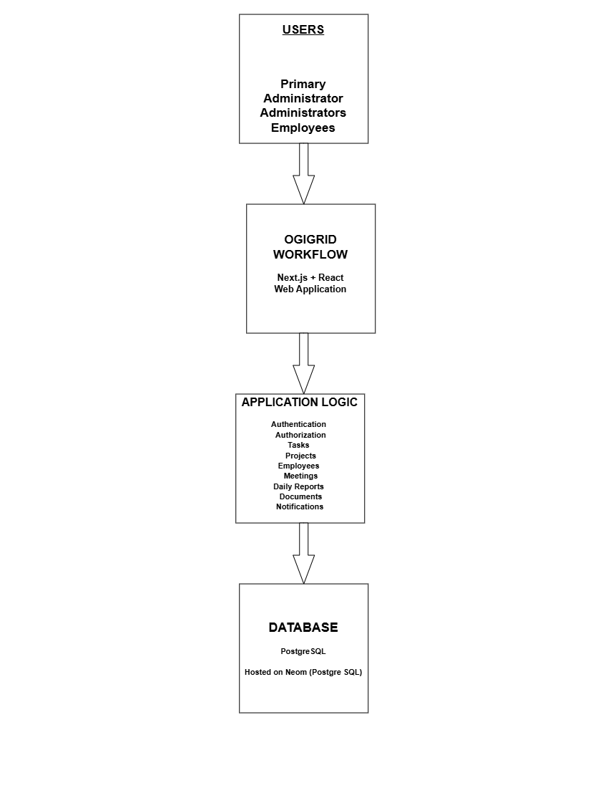
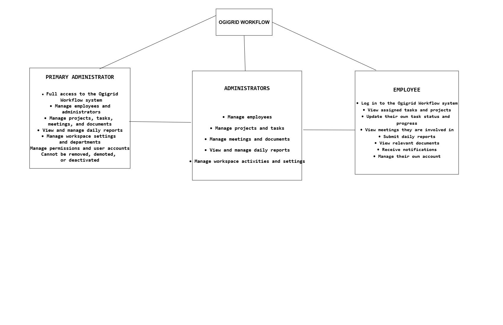

# Ogigrid Workflow — Technical Documentation

## 1. Project Overview

### 1.1 Introduction

Ogigrid Workflow is an internal work-management and workflow application designed for Ogigrid. The system provides a centralized platform for managing employees, tasks, projects, meetings, schedules, documents, daily reports, notifications, and other internal work activities.

The application is designed to replace scattered or manual methods of managing internal work with a structured digital workflow. It allows authorized members of the organization to access the appropriate work-management features based on their account and role.

### 1.2 Purpose

The primary purpose of Ogigrid Workflow is to provide a single internal platform where organizational activities can be created, assigned, tracked, updated, and managed.

The system provides functionality for:

- Employee management
- Task management
- Project management
- Meeting management
- Schedule management
- Daily report management
- Document management
- Notifications
- User authentication and authorization
- Account and workspace management

### 1.3 Intended Users

Ogigrid Workflow is intended for authorized members of Ogigrid.

The application supports different user roles and permissions so that administrative functions can be restricted to users with the appropriate level of access.

### 1.4 System Goal

The goal of the system is to create a reliable internal workflow environment where work can be organized and monitored from a single application.

By centralizing these activities, Ogigrid can improve task visibility, accountability, communication, documentation, and overall operational efficiency.

### 1.5 Application Environment

The application is developed as a web-based application and is accessible through a browser.

The production application is deployed on Vercel. PostgreSQL is used for persistent data storage, with Neon providing the hosted PostgreSQL environment for cloud/production use. The project source code is maintained using Git and GitHub.

---

## 2. Project Objectives

The main objectives of Ogigrid Workflow are to:

- Centralize internal work-management activities.
- Provide structured employee and account management.
- Allow tasks to be created, assigned, tracked, and updated.
- Organize work through projects.
- Provide meeting and scheduling functionality.
- Support daily work reporting.
- Provide centralized document management.
- Provide relevant notifications to users.
- Implement authentication and role-based access control.
- Provide persistent storage through PostgreSQL.
- Provide a scalable foundation for future workflow improvements.

---

## 3. Technology Stack

### 3.1 JavaScript

JavaScript is the underlying programming language used throughout the application ecosystem.

### 3.2 TypeScript

TypeScript is used to provide static typing and improved type safety.

It helps define the expected structure of application data such as users, employees, tasks, projects, meetings, and other entities.

### 3.3 React

React is used to build the application's user interface through reusable components.

### 3.4 Next.js

Next.js is the primary application framework.

It provides:

- React-based user interfaces
- File-system-based routing
- Server-side functionality
- API routes
- Application build and optimization features

The application uses the Next.js App Router structure.

### 3.5 Node.js

Node.js provides the server-side JavaScript runtime used by the application and its supporting scripts.

It also provides the runtime environment for project tooling and npm scripts.

### 3.6 Tailwind CSS

Tailwind CSS is used for interface styling and layout.

It provides utility classes for:

- Spacing
- Typography
- Colors
- Borders
- Layout
- Responsive design
- Component styling

### 3.7 PostgreSQL

PostgreSQL is the relational database management system used for persistent application data.

### 3.8 Neon

Neon provides the hosted PostgreSQL environment used for the cloud/production database.

This separates the production database from the local development environment.

### 3.9 `pg`

The `pg` Node.js package is used by the server-side application to communicate with PostgreSQL.

The general connection flow is:

```text
Next.js Server
      ↓
     pg
      ↓
DATABASE_URL
      ↓
Neon
      ↓
PostgreSQL
```

### 3.10 bcryptjs

`bcryptjs` is used for password hashing and password verification.

Passwords are not intended to be stored as plain-text values.

### 3.11 Git

Git is used for source-code version control and maintaining the project's development history.

### 3.12 GitHub

GitHub hosts the remote Git repository and provides centralized source-code storage.

### 3.13 npm

npm is used to manage project dependencies and execute project scripts.

Examples include:

```bash
npm run dev
npm run build
npm run start
npm run db:migrate
```

### 3.14 Vercel

Vercel is used to deploy and host the production Next.js application.

---

## 4. Project Structure

The project follows a modular structure that separates application routes, reusable components, shared logic, server-side logic, database resources, and configuration.

### 4.1 `app/`

The `app` directory contains the application's routes and pages using the Next.js App Router.

Major application areas include:

- Dashboard
- Daily Reports
- Documents
- Employees
- Meetings
- Projects
- Schedule
- Settings
- Tasks
- Login

### 4.2 `app/api/`

The `app/api` directory contains server-side API routes.

Examples include:

```text
/api/auth/login
/api/auth/signup
/api/auth/logout
/api/auth/me
/api/employees
/api/projects
/api/tasks
/api/meetings
/api/documents
/api/daily-reports
/api/notifications
```

These endpoints provide communication between the frontend and server-side application logic.

### 4.3 `components/`

The `components` directory contains reusable user-interface components.

It includes areas such as:

- Authentication components
- Dashboard components
- Layout components
- Schedule components
- Task components
- General UI components

Reusable components reduce duplication and provide consistency throughout the application.

### 4.4 `lib/`

The `lib` directory contains shared application logic and definitions.

Important areas include:

- Authentication logic
- Application state
- Data definitions
- TypeScript types
- Server-side functionality

### 4.5 `lib/server/`

The `lib/server` directory contains server-side application logic.

This includes functionality related to:

- Access guards
- Password operations
- Sessions
- Data repositories
- Data mapping

### 4.6 `public/`

The `public` directory contains static assets that can be served directly by the application.

For example, the Ogigrid logo is stored as a public asset and can be referenced by its public path.

### 4.7 `db/`

The `db` directory contains database-related resources, including SQL migrations.

### 4.8 `scripts/`

The `scripts` directory contains utility scripts used by the project.

The database migration script is used to apply database migrations.

### 4.9 `package.json`

`package.json` defines:

- Project metadata
- Dependencies
- Development dependencies
- npm scripts

### 4.10 `.env`

The `.env` file contains environment-specific configuration and sensitive values such as the database connection configuration.

Sensitive environment files should not be committed to the public repository.

### 4.11 `.env.example`

`.env.example` provides a template showing which environment variables the application expects without exposing the actual secret values.

---

## 5. System Architecture

Ogigrid Workflow follows a layered web-application architecture.

The high-level flow is:

```text
User
  ↓
Browser
  ↓
React / Next.js Interface
  ↓
Next.js API Routes
  ↓
Authentication / Authorization
  ↓
Server-side Application Logic
  ↓
PostgreSQL
  ↓
Response
  ↓
Browser
```

The frontend is responsible for presenting the interface and collecting user interactions.

The API layer handles communication between the frontend and server-side application.

The server-side layer handles authentication, authorization, business operations, and data access.

PostgreSQL provides persistent storage.

The browser does not directly access the production database.

---

## 6. Authentication and Authorization

### 6.1 Authentication

Authentication determines whether a user is a valid account holder.

Users authenticate using their account credentials.

The general login flow is:

```text
Email + Password
       ↓
Login Request
       ↓
Authentication Logic
       ↓
Account Lookup
       ↓
Password Verification
       ↓
Session Established
       ↓
Authenticated Application Access
```

### 6.2 Authorization

Authorization determines what an authenticated user is allowed to do.

The application supports different account roles, including Administrator and Employee.

Role information can be used to restrict administrative functionality.

### 6.3 First Workspace Account

When the workspace has no users, the first account created becomes the Primary Administrator.

The Primary Administrator receives full administrator access and is specially protected from normal removal, demotion, or deactivation.

### 6.4 Password Security

Passwords are processed using `bcryptjs`.

The general process is:

```text
Password
   ↓
bcryptjs
   ↓
Password Hash
   ↓
Stored Account Data
```

During login, the supplied password is verified against the stored password hash.

### 6.5 Sessions

After successful authentication, a session is established so that the application can maintain the user's authenticated state while navigating protected areas.

### 6.6 Route Protection

Protected routes are controlled through authentication checks and route-guard functionality.

Unauthenticated users should not be allowed to access protected application areas.

---

## 7. Database Architecture

### 7.1 Database Technology

The application uses PostgreSQL as its relational database.

PostgreSQL provides persistent storage for application data.

### 7.2 Production Database

The production PostgreSQL database is hosted through Neon.

The application connects to the hosted database through the `DATABASE_URL` environment variable.

The production architecture is:

```text
Vercel
  ↓
Next.js Application
  ↓
pg
  ↓
DATABASE_URL
  ↓
Neon
  ↓
PostgreSQL
```

### 7.3 Database Access

The browser does not directly connect to PostgreSQL.

Database operations occur through server-side application code.

### 7.4 Database Migrations

Database structure is managed through SQL migration files.

The project contains database migration resources under:

```text
db/migrations/
```

The migration process is executed using:

```bash
npm run db:migrate
```

The migration script connects to the configured PostgreSQL database and applies pending migrations.

### 7.5 Local and Production Environments

PostgreSQL can be used locally during development and testing, while the deployed production application uses the hosted PostgreSQL environment provided through Neon.

The local and production database environments are therefore separate environments.

---

## 8. API Architecture

The application exposes server-side API routes through Next.js.

API endpoints provide communication between the frontend and backend logic.

Examples include:

```text
/api/auth/login
/api/auth/signup
/api/auth/logout
/api/auth/me

/api/tasks
/api/projects
/api/employees
/api/meetings
/api/documents
/api/daily-reports
/api/notifications
```

Typical HTTP methods include:

- `GET` — retrieve data
- `POST` — create data
- `PATCH` or `PUT` — update data
- `DELETE` — remove data

### Example Data Flow

Creating a task follows the general pattern:

```text
Task Form
   ↓
React
   ↓
POST /api/tasks
   ↓
Authentication Check
   ↓
Authorization Check
   ↓
Server-side Data Logic
   ↓
PostgreSQL
   ↓
Response
   ↓
React UI
```

The API layer prevents the frontend from needing direct access to the database.

---

## 9. Core Application Modules

### 9.1 Dashboard

Provides an overview of relevant organizational activity.

### 9.2 Employees

Provides employee information and employee-management functionality.

### 9.3 Projects

Allows work to be organized into projects.

### 9.4 Tasks

Provides task creation, assignment, tracking, and status management.

### 9.5 Meetings

Provides meeting-management functionality.

### 9.6 Schedule

Provides scheduling functionality for organizational activities.

### 9.7 Documents

Provides centralized document-management functionality.

### 9.8 Daily Reports

Allows users to record and submit daily work reports.

### 9.9 Notifications

Provides users with relevant workflow and system notifications.

### 9.10 Settings

Provides account and application configuration functionality.

---

## 10. State and Data Management

The application uses different levels of state and data management.

### Client-side State

React state is used for temporary interface information such as:

- Form values
- Loading states
- Modal visibility
- Selected items
- Other interactive UI state

### Shared Application State

The application uses shared provider/store functionality for information that needs to be accessed across multiple components.

### Persistent Server Data

Persistent organizational data is stored in PostgreSQL.

The general relationship is:

```text
React State
     ↓
API Request
     ↓
Server-side Logic
     ↓
PostgreSQL
```

Client-side state and persistent database data are therefore separate concepts.

---

## 11. Security

Security is implemented across multiple layers of the application.

### 11.1 Password Protection

Passwords are hashed using `bcryptjs`.

### 11.2 Authentication

Users must authenticate before accessing protected functionality.

### 11.3 Authorization

User roles and permissions are used to restrict access to administrative functionality.

### 11.4 Route Protection

Protected application routes are guarded against unauthorized access.

### 11.5 Server-side Database Access

Database credentials are kept on the server through environment configuration rather than being exposed to the browser.

### 11.6 Environment Variables

Sensitive configuration such as `DATABASE_URL` is stored through environment variables.

Actual secret values should not be committed to GitHub.

---

## 12. Development Workflow

The development workflow consists of:

```text
Develop
   ↓
Run Locally
   ↓
Test
   ↓
Fix Issues
   ↓
Production Build
   ↓
Git Commit
   ↓
Git Push
   ↓
Vercel Deployment
```

Common development commands include:

```bash
npm run dev
npm run build
npm run start
npm run db:migrate
```

The development server is used for local testing, while the production build verifies that the application can successfully compile for deployment.

---

## 13. Git and GitHub Workflow

Git is used to track changes to the project.

The general workflow is:

```text
Local Project
     ↓
Git Add
     ↓
Git Commit
     ↓
Git Push
     ↓
GitHub Repository
```

GitHub acts as the remote repository containing the project's source code.

Version control makes it possible to maintain a history of project changes and collaborate on the codebase.

---

## 14. Deployment Architecture

The production application is deployed through Vercel.

The deployment architecture is:

```text
Developer
    ↓
Local Project
    ↓
Git
    ↓
GitHub
    ↓
Vercel
    ↓
Next.js Production Application
    ↓
Neon PostgreSQL
```

Vercel hosts the web application while Neon hosts the production PostgreSQL database.

The two services communicate through the configured database connection.

---

## 15. Production Configuration

Production deployment requires the appropriate environment configuration.

The application uses environment variables to provide configuration that differs between development and production.

The production environment must contain the correct database connection information, including the appropriate `DATABASE_URL`.

Sensitive configuration should be stored securely through the hosting platform's environment-variable system.

---

## 16. Testing and Verification

Several verification steps were performed during development and deployment.

### 16.1 Database Migration

The database migration command was successfully executed:

```bash
npm run db:migrate
```

The migration process successfully applied the initial database migration.

### 16.2 Production Build

The production build was successfully executed:

```bash
npm run build
```

The build completed successfully with:

```text
Compiled successfully
Linting and checking validity of types
Collecting page data
Generating static pages
Collecting build traces
Finalizing page optimization
```

This confirmed that the application successfully passed the production compilation and type-checking stages.

### 16.3 Route Verification

The successful production build recognized the application's pages and API routes, including authentication, tasks, projects, employees, meetings, documents, reports, notifications, and other application areas.

### 16.4 Production Deployment

The application was successfully deployed to Vercel and made accessible through its production deployment URL.

---

## 17. Known Limitations and Future Improvements

Possible future improvements include:

- More advanced role and permission controls
- Expanded workflow automation
- Additional reporting and analytics
- More advanced notification functionality
- Additional integrations
- More comprehensive automated testing
- Additional security hardening
- Performance optimization
- Custom production domain configuration
- Additional administrative features

These improvements can be introduced as the internal requirements of Ogigrid evolve.

---

## 18. Final System Summary

Ogigrid Workflow is a full-stack internal work-management application built with Next.js, React, TypeScript, and Tailwind CSS.

The application provides modules for employees, projects, tasks, meetings, schedules, documents, daily reports, notifications, and account management.

Authentication and authorization provide controlled access to the system, while password hashing and protected server-side operations provide important security mechanisms.

PostgreSQL provides persistent relational data storage, with Neon providing the hosted PostgreSQL environment for cloud/production use. The `pg` package provides server-side communication between the Next.js application and PostgreSQL.

The project is managed with Git and GitHub and deployed through Vercel.

The overall architecture can be summarized as:

```text
                    USER
                      ↓
                  BROWSER
                      ↓
               REACT / NEXT.JS
                      ↓
                API ROUTES
                      ↓
          AUTHENTICATION / AUTHORIZATION
                      ↓
             SERVER-SIDE LOGIC
                      ↓
                     pg
                      ↓
                NEON CLOUD
                      ↓
                POSTGRESQL
```

This architecture provides Ogigrid with a centralized foundation for managing internal work and can be extended as the organization's workflow requirements grow.


## 7. Database Architecture and Data Management

### 7.1 Database Technology

Ogigrid Workflow uses **PostgreSQL** as its relational database management system.

PostgreSQL is responsible for storing the application's persistent data, including information related to users, employees, tasks, projects, meetings, schedules, reports, documents, and other workflow records.

### 7.2 Database Hosting

The PostgreSQL database is hosted using **Neon**, a cloud-based PostgreSQL platform.

The application connects to the hosted PostgreSQL database through a database connection string configured through environment variables.

The database connection details are not stored directly in the source code. Sensitive configuration values are stored in the `.env` file and are excluded from version control.

### 7.3 Database Layer

The project contains a `db/` directory responsible for database-related functionality.

This layer separates database operations from the user interface and application components, making the application easier to maintain and modify.

The general data flow is:

**User → Next.js Application → Application Logic → Database Layer → PostgreSQL**

### 7.4 Database Migrations

Database migrations are used to apply controlled changes to the database structure.

A migration may be required when the application introduces a new table, modifies an existing table, adds a column, changes a relationship, or otherwise changes the database schema.

Instead of manually modifying the production database, migrations provide a repeatable way to keep the database structure synchronized with the application's expected schema.

For example, if a new feature requires a `notifications` table, the database schema can be updated through a migration so that the same change can be reproduced consistently across development and production environments.

### 7.5 Database Backup

The project also contains a PostgreSQL database backup file:

`ogigrid_backup.sql`

This provides a database export that can be used for backup, recovery, or development purposes when appropriate.

Database backups should be handled carefully because they may contain application data.

### 7.6 Environment Configuration

Database connection information is configured through environment variables rather than being hard-coded into the application.

The project contains:

- `.env` — local environment configuration
- `.env.example` — example configuration showing the variables required by the application

The actual values contained in `.env` should remain private and must not be committed to a public repository.

## 8. Deployment and Hosting

The application is deployed as a web application using **Vercel**.

The production deployment runs the Next.js application while the application's persistent data remains stored in the hosted PostgreSQL database on Neon.

The deployment architecture can therefore be summarized as:

**User Browser → Vercel → Next.js Application → PostgreSQL (Neon)**

This separation allows the web application and database to be managed independently while communicating through the application's database connection.


## 9. Security, Authentication and Authorization

### 9.1 Authentication

Ogigrid Workflow uses an authentication system to verify the identity of users before allowing access to protected areas of the application.

Users are required to log in before accessing internal workflow features.

The authentication process ensures that only authorized members of Ogigrid can access the internal application.

### 9.2 Authorization

Authentication determines **who the user is**, while authorization determines **what the user is allowed to do**.

Ogigrid Workflow uses role-based access control to restrict certain functionality according to the user's role.

The application supports different levels of access, including:

- Primary Administrator
- Administrators
- Employees

Administrative functions are restricted to users with the appropriate permissions.

### 9.3 Session Management

After successful authentication, the application maintains the user's authenticated session so that the user does not need to repeatedly log in while using the application.

Authentication information is handled through secure application mechanisms rather than being exposed directly in the user interface.

Sessions are configured with an expiration period so that access does not remain valid indefinitely.

### 9.4 Protected Routes

Internal pages and features that require authentication are protected from unauthorized access.

A user who is not authenticated should not be able to directly access protected workflow pages by entering their URL.

Route protection ensures that authentication is checked before access to restricted areas is granted.

### 9.5 Role-Based Access

Different users may have different responsibilities within the organization.

For example:

- Administrators may manage employees and organizational settings.
- Employees may access the workflow features relevant to their assigned work.
- Higher-level administrative actions are restricted from ordinary employees.

This approach reduces the possibility of unauthorized users modifying sensitive organizational information.

### 9.6 Environment and Secret Management

Sensitive configuration values such as database credentials, authentication secrets, and other private environment variables are stored using environment configuration.

These values are kept outside the source code and should not be committed to a public Git repository.

The `.env.example` file provides a reference for required environment variables without exposing their actual secret values.

### 9.7 Security Objective

The security architecture is designed to ensure that:

- Only authorized users can access the internal system.
- Users can only perform actions permitted by their role.
- Sensitive configuration values remain private.
- Protected application routes cannot be accessed without authentication.
- Authentication sessions expire appropriately.

Security controls should be reviewed and tested before the workflow is adopted as an official internal work-management system.


## 10. Testing and Quality Assurance

Testing is performed to verify that Ogigrid Workflow behaves correctly, that major features are functional, and that changes do not introduce avoidable errors.

### 10.1 Build Verification

The production build was tested using:

```bash
npm run build
```

The build completed successfully, including:

- Compilation
- Linting
- Type checking
- Page-data collection
- Static page generation
- Build trace generation
- Production optimization

This confirms that the application can successfully compile as a production Next.js application.

### 10.2 Database Verification

The database migration process was tested using:

```bash
npm run db:migrate
```

The migration successfully initialized the required database structure.

### 10.3 Authentication Testing

Authentication functionality should be tested for:

- Account creation
- Login with valid credentials
- Rejection of invalid credentials
- Logout
- Session persistence
- Session expiration
- Access to protected pages
- Unauthorized access attempts

### 10.4 Role and Permission Testing

Different user roles should be tested to verify that permissions are correctly enforced.

Testing should confirm that:

- Administrators can access administrative functionality.
- Employees cannot access restricted administrative functionality.
- Protected actions cannot be performed by unauthorized users.
- The Primary Administrator receives the intended special protections.

### 10.5 Functional Testing

The major application modules should be tested individually.

| Module | Main functionality to verify |
|---|---|
| Dashboard | Information loads correctly |
| Employees | Employees can be viewed and managed according to permissions |
| Projects | Projects can be created, viewed, updated, and managed |
| Tasks | Tasks can be created, assigned, updated, and tracked |
| Meetings | Meetings can be created and managed |
| Schedule | Scheduled activities display correctly |
| Documents | Documents can be managed correctly |
| Daily Reports | Reports can be created and submitted |
| Notifications | Notifications appear and can be marked as read |
| Settings | Account/application settings behave correctly |

### 10.6 API Testing

API routes should be tested to verify that they:

- Accept valid requests.
- Return appropriate responses.
- Reject invalid requests.
- Enforce authentication where required.
- Enforce authorization where required.
- Correctly read from and write to PostgreSQL.

### 10.7 Production Testing

After deployment, the production application should be tested through its live deployment.

The following should be verified:

1. The application loads successfully.
2. Login works.
3. Protected routes behave correctly.
4. Database operations work.
5. Users can perform permitted actions.
6. Unauthorized actions are rejected.
7. Notifications and other workflow features operate correctly.

### 10.8 Regression Testing

Whenever a significant change is made, previously working features should be tested again.

This helps ensure that fixing or adding one feature does not unintentionally break another part of the system.

### 10.9 Testing Objective

The objective of testing is to establish sufficient confidence that the application is stable and suitable for internal use before it is adopted as Ogigrid's official internal workflow system.


## 11. Deployment, Maintenance and Operations

### 11.1 Deployment Process

Ogigrid Workflow is deployed as a production Next.js application using Vercel.

The general deployment process is:

```text
Local Development
       ↓
Testing
       ↓
Production Build
       ↓
Git Commit
       ↓
Git Push
       ↓
GitHub Repository
       ↓
Vercel Deployment
       ↓
Production Application
```

Changes made to the project can be committed to Git and pushed to the remote GitHub repository. Vercel can then use the repository as the source for production deployment.

### 11.2 Production Environment

The production application runs independently from the local development environment.

The production environment consists primarily of:

- Vercel — application hosting and deployment
- Next.js — application framework
- Neon — hosted PostgreSQL database
- PostgreSQL — persistent data storage
- Environment variables — production configuration and secrets

### 11.3 Environment Variables

Environment variables allow configuration to change between development and production without modifying application source code.

Examples of configuration that may be provided through environment variables include:

- Database connection information
- Authentication secrets
- Application configuration

Sensitive values must remain private and should not be committed to the Git repository.

### 11.4 Database Operations

The production database is hosted through Neon and uses PostgreSQL.

Database schema changes should be introduced through migrations rather than uncontrolled manual modifications.

Before applying significant database changes to production, the change should be tested in a suitable development or testing environment.

### 11.5 Application Updates

Future application updates should follow a controlled workflow:

```text
Make Change
    ↓
Test Locally
    ↓
Run Production Build
    ↓
Review Changes
    ↓
Commit to Git
    ↓
Push to GitHub
    ↓
Deploy
    ↓
Verify Production
```

This reduces the possibility of deploying untested changes.

### 11.6 Monitoring and Error Checking

After important deployments, the production application should be checked for:

- Application errors
- Authentication failures
- API failures
- Database connection problems
- Unexpected UI behaviour
- Broken routes
- Permission issues

Deployment logs and application errors should be reviewed when problems occur.

### 11.7 Backup and Recovery

The project contains a PostgreSQL database backup file that can support recovery or development activities when appropriate.

Production data should be backed up regularly as the system becomes more important to Ogigrid's daily operations.

Backups should be stored securely and should not be exposed through the public repository.

### 11.8 Maintenance

Maintenance activities may include:

- Updating dependencies
- Fixing application bugs
- Improving security
- Updating database schemas
- Reviewing user permissions
- Monitoring application performance
- Improving user experience
- Maintaining backups
- Reviewing production logs

Maintenance should be performed in a controlled manner to avoid disrupting internal operations.

### 11.9 Operational Responsibility

As Ogigrid Workflow becomes an internal work-management system, operational responsibilities should be clearly assigned.

These responsibilities may include:

- Managing administrator accounts
- Managing employees and permissions
- Monitoring system availability
- Managing database backups
- Reviewing reported issues
- Approving major application changes
- Maintaining deployment configuration

This helps ensure that the application remains reliable after adoption.


## 12. Future Improvements and Scalability

Ogigrid Workflow provides a foundation for managing internal organizational activities, but the system can be extended as the organization's requirements grow.

### 12.1 Future Features

Potential improvements include:

- More detailed role and permission management
- Advanced task workflows
- Automated workflow notifications
- Improved reporting and analytics
- Dashboard customization
- Advanced search and filtering
- Calendar integrations
- Email and messaging integrations
- Additional document-management capabilities
- Activity and audit logs
- More comprehensive administrative controls

### 12.2 Scalability

The current architecture provides a foundation that can be expanded without completely redesigning the application.

The separation between the user interface, server-side application logic, API routes, and PostgreSQL database allows individual parts of the system to be improved independently.

As Ogigrid's usage increases, possible improvements may include:

- Database performance optimization
- Query optimization
- Improved caching
- Additional monitoring
- More comprehensive automated testing
- Infrastructure optimization
- Improved backup and recovery procedures

### 12.3 Security Improvements

Security should continue to evolve as the application becomes more important to organizational operations.

Future security improvements may include:

- Stronger password requirements
- Multi-factor authentication
- More granular permissions
- Detailed audit logging
- Improved session management
- Security monitoring
- Regular dependency and vulnerability reviews

### 12.4 Integration Opportunities

The system can potentially be integrated with other organizational tools in the future.

Possible integrations include:

- Email services
- Calendar systems
- Messaging platforms
- File-storage systems
- Human-resource systems
- Business analytics tools

Such integrations should be introduced according to Ogigrid's operational requirements.

---

## 13. Conclusion

Ogigrid Workflow is a full-stack internal work-management application developed to provide Ogigrid with a centralized platform for organizing and managing internal work.

The application combines a Next.js and React-based web interface with server-side application logic and a PostgreSQL database hosted through Neon.

The system provides functionality for employee management, projects, tasks, meetings, schedules, documents, daily reports, notifications, authentication, authorization, and account management.

The application uses Git and GitHub for source-code management and Vercel for production deployment.

The system architecture separates the user interface, application logic, and persistent database layer, providing a foundation that can be maintained and extended as organizational requirements change.

The project has also been documented through technical Markdown documentation and system architecture diagrams to make the application's structure and operation easier to understand and maintain.

Before full organizational adoption, the deployed system should undergo comprehensive functional, security, database, permission, and production testing.

Following successful testing and approval, Ogigrid Workflow can serve as Ogigrid's internal work-management and workflow platform.

The project can continue to evolve through additional automation, integrations, security improvements, analytics, and workflow features as the organization grows.


## System Architecture

The overall architecture of the Ogigrid Workflow system is illustrated below.




## System Roles and Use Cases

The following diagram illustrates the main user roles and their responsibilities within the system.

